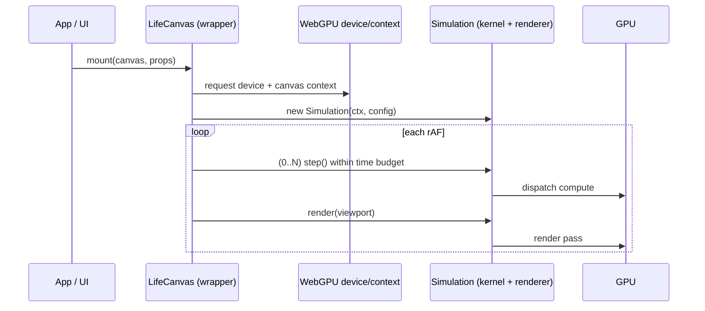

# Games of Life

**Games of Life** is a WebGPU-powered cellular automaton engine + a demo app.

This repo is a **monorepo**:

- A **library** you can embed anywhere (icons, buttons, hero canvases, tools)
- A **SvelteKit app** showcasing the engine (rule editor, presets, brush tools)

<p align="center">
  
</p>

**[Live Demo →](https://neovand.github.io/games-of-life/)**


## Features

- **WebGPU CA kernel**: double-buffered compute + render for smooth performance
- **Square + hex grids** (and an architecture that keeps future tilings in mind)
- **Multi-state “Generations” rules** (B/S + N states)
- **Vitality influence**: dying cells can contribute positively/negatively via a user curve
- **Brush system**: paint/erase with preview (including hex-friendly circle brush)
- **CPU fallback kernel** (useful for mini-sims, tests, or non-WebGPU environments)

## Packages (the library)

| Package | What it is | When to use it |
|---|---|---|
| `@games-of-life/core` | UI/framework-free specs + rule parsing + vitality + seeds + CPU stepper | Shared “single source of truth”, CPU fallback |
| `@games-of-life/webgpu` | Framework-free WebGPU runtime (`Simulation`, WGSL shaders, context helpers) | Vanilla/React/Svelte/Web Components |
| `@games-of-life/svelte` | Svelte 5 wrapper components (`LifeCanvas`) | Drop-in canvases in Svelte apps |

The demo app uses these packages via workspace deps (see `package.json`).

## How it works (high level)

The simulation runs as a compute shader on the GPU. Each frame, the shader reads the current grid state, applies the cellular automaton rules in parallel across all cells, and writes to a second buffer. The buffers swap each frame (double buffering).

```mermaid
flowchart LR
  A([Cell buffer A]) -->|read| C([Compute (step)])
  C -->|write| B([Cell buffer B])
  B -->|swap| A

  R([Rule + view params]) --> C
  P([Brush paint ops]) --> C

  A --> D([Render])
  D --> E([Canvas])
```

### Typical frame sequence



## Using the library

### Svelte: embed anywhere

```svelte
<script lang="ts">
  import { LifeCanvas } from '@games-of-life/svelte';
  import type { RuleSpec } from '@games-of-life/core';

  const rule: RuleSpec = {
    name: "Conway's Life",
    birthMask: 0b0000_1000,   // B3
    surviveMask: 0b0000_1100, // S23
    numStates: 2,
    neighborhood: 'moore'
  };
</script>

<LifeCanvas
  width={140}
  height={140}
  gridWidth={64}
  gridHeight={64}
  {rule}
  playing={true}
  speed={12}
  seed={{ kind: 'random', density: 0.22, includeSpectrum: true }}
/>
```

### Framework-agnostic: drive the WebGPU Simulation yourself

```ts
import { initWebGPU, Simulation } from '@games-of-life/webgpu';

const res = await initWebGPU(canvas);
if (!res.ok) throw new Error(res.error.message);

const sim = new Simulation(res.value, {
  width: 256,
  height: 256,
  rule: { birthMask: 0b1000, surviveMask: 0b1100, numStates: 2, neighborhood: 'moore' }
});

sim.randomize(0.25);

function frame() {
  sim.step();
  sim.render(canvas.width, canvas.height);
  requestAnimationFrame(frame);
}
frame();
```

## The demo app (what’s in `src/`)

The SvelteKit app is a “kitchen sink” UI around the library: rule editor + previews, grid initialization, brush tools, tour gallery, and visualization controls.

## Running locally

```bash
npm install
npm run dev
```

Requires a browser with WebGPU support (Chrome/Edge/Safari 18+; Firefox Nightly with flags).

## Controls

| Key | Action |
|-----|--------|
| `Enter` | Play/Pause |
| `S` | Step forward |
| `B` | Toggle brush/pan mode |
| `Click` / `Right-click` | Draw / Erase |
| `Scroll` | Zoom |
| `Space` (hold) | Pan |
| `[ ]` | Decrease/Increase brush size |
| `, .` | Slower/Faster simulation |
| `E` | Rule editor |
| `I` | Initialize modal |
| `R` | Reinitialize grid |
| `D` | Clear grid |
| `F` / `Home` | Fit to screen |
| `G` | Toggle grid lines |
| `A` | Toggle axes |
| `T` | Toggle light/dark theme |
| `C` | Cycle colors |
| `Shift+C` | Cycle spectrum modes |
| `V` | Start/Stop video recording |
| `?` | Help overlay |
| `Esc` | Close modals |

## License

MIT
