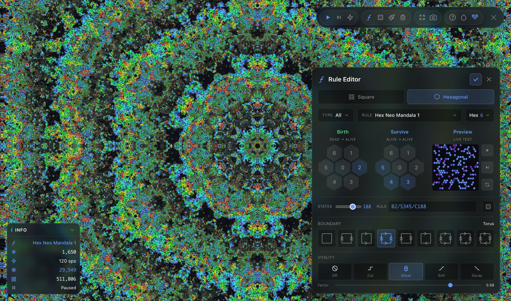
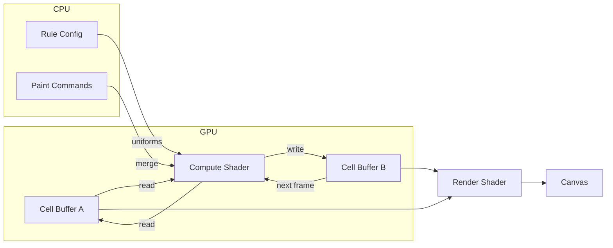

# Games of Life

A WebGPU-powered cellular automaton simulator. Runs entirely on the GPU for smooth performance even on large grids.

<p align="center">
  
</p>

**[Live Demo →](https://neovand.github.io/games-of-life/)**


## Features

- **100+ Rule Presets** — Classic Conway's Life, Star Wars, Brian's Brain, artistic hexagonal patterns, and more
- **Visual Rule Editor** — Live preview, searchable presets, import/export rules as JSON
- **Multiple Grid Types** — Square and hexagonal grids with 5 neighborhood types
- **9 Boundary Topologies** — Plane, Cylinder, Torus, Möbius Strip, Klein Bottle, Projective Plane
- **Multi-State Rules** — Up to 1024 decay states with colorful trails
- **18 Color Spectrums** — From thermal gradients to neon bands, all reactive to your chosen color
- **Vitality Curves** — Shape how dying cells influence neighbors with an interactive curve editor
- **Drawing Tools** — Multiple brush shapes, text stamps, fill patterns, and adjustable sizes
- **Pattern Library** — Initialize with oscillators, spaceships, or tiled structures
- **Undo/Redo History** — Visual timeline to navigate your changes
- **Touch Friendly** — Pinch to zoom, pan mode, responsive controls

## How It Works

The simulation runs as a compute shader on the GPU. Each frame, the shader reads the current grid state, applies the cellular automaton rules in parallel across all cells, and writes to a second buffer. The buffers swap each frame (double buffering).



### Rule Encoding

Rules are encoded as bitmasks for fast GPU lookup:

```
B3/S23 (Conway's Life)
├── Birth mask:   0b000001000  (bit 3 set → birth with 3 neighbors)
└── Survive mask: 0b000001100  (bits 2,3 set → survive with 2 or 3)
```

The compute shader checks neighbors and uses bitwise AND to determine the next state—no branching required.

### Neighborhood Memory

Standard cellular automata count neighbors as binary—alive cells contribute 1, dead cells contribute 0. This simulator extends the model by allowing *dying* cells (those in decay states) to contribute based on their **vitality**:

```
Standard:    N = Σ (alive neighbors)
With memory: N = Σ (alive) + Σ f(vitality)
```

- **Alive cells** always contribute 1
- **Dead cells** always contribute 0
- **Dying cells** contribute `f(v)` where vitality `v = (S - state) / (S - 1)` fades from 1 → 0 as the cell decays through S states

The curve `f(v)` is user-defined and can output values from −2 to +2. Positive values count toward neighbor totals, negative values *inhibit* neighbors, and zero makes the cell invisible to counting. This creates **memory effects**—a cell's influence persists and fades over time rather than vanishing instantly, enabling smoother dynamics and emergent patterns not possible in standard rules.

## Tech Stack

- **WebGPU** — Compute shaders for simulation, render shaders for visualization
- **Svelte 5** — Reactive UI with runes (`$state`, `$derived`, `$effect`)
- **SvelteKit** — Static site generation via `adapter-static`
- **TypeScript** — Type-safe GPU buffer management
- **WGSL** — WebGPU Shading Language for both compute and fragment shaders

## Running Locally

```bash
npm install
npm run dev
```

Requires a browser with WebGPU support (Chrome 113+, Edge 113+, Safari 18+, or Firefox Nightly with flags).

## Controls

| Key | Action |
|-----|--------|
| `Enter` | Play/Pause |
| `S` | Step forward |
| `B` | Toggle brush/pan mode |
| `Click` / `Right-click` | Draw / Erase |
| `Scroll` | Zoom |
| `Space` (hold) | Pan |
| `[ ]` | Decrease/Increase brush size |
| `, .` | Slower/Faster simulation |
| `E` | Rule editor |
| `I` | Initialize modal |
| `R` | Reinitialize grid |
| `D` | Clear grid |
| `F` / `Home` | Fit to screen |
| `G` | Toggle grid lines |
| `A` | Toggle axes |
| `T` | Toggle light/dark theme |
| `C` | Cycle colors |
| `Shift+C` | Cycle spectrum modes |
| `V` | Start/Stop video recording |
| `?` | Help overlay |
| `Esc` | Close modals |

## License

MIT
